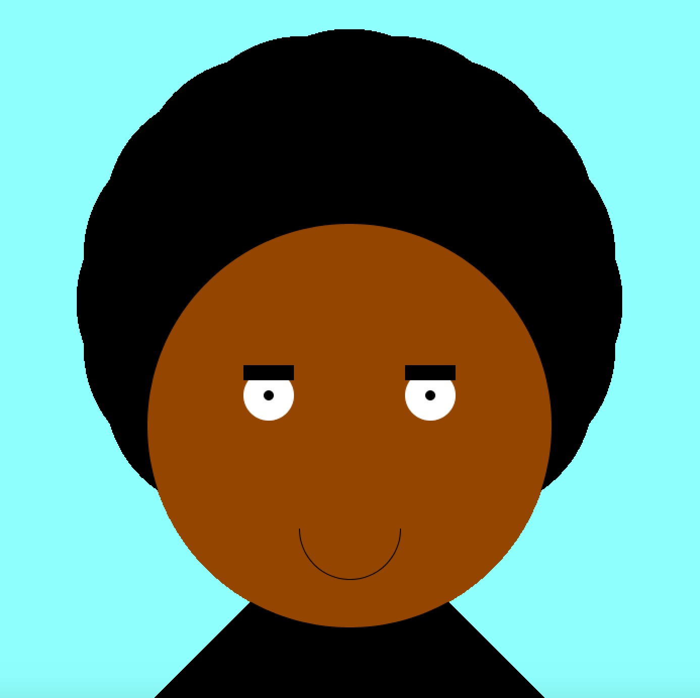

# Portrait of Myself using Processing (Java)
For this project, I made a portrait of myself using Processing. It was a cool way to brush up on Processing concepts and I had fun while doing this project. The most difficult thing to do was to find the right placement of the shapes. One thing that helped was to place everything in relation to the the window's width and height, which I declared both as global variable that I used throughout the shapes' creations. 

