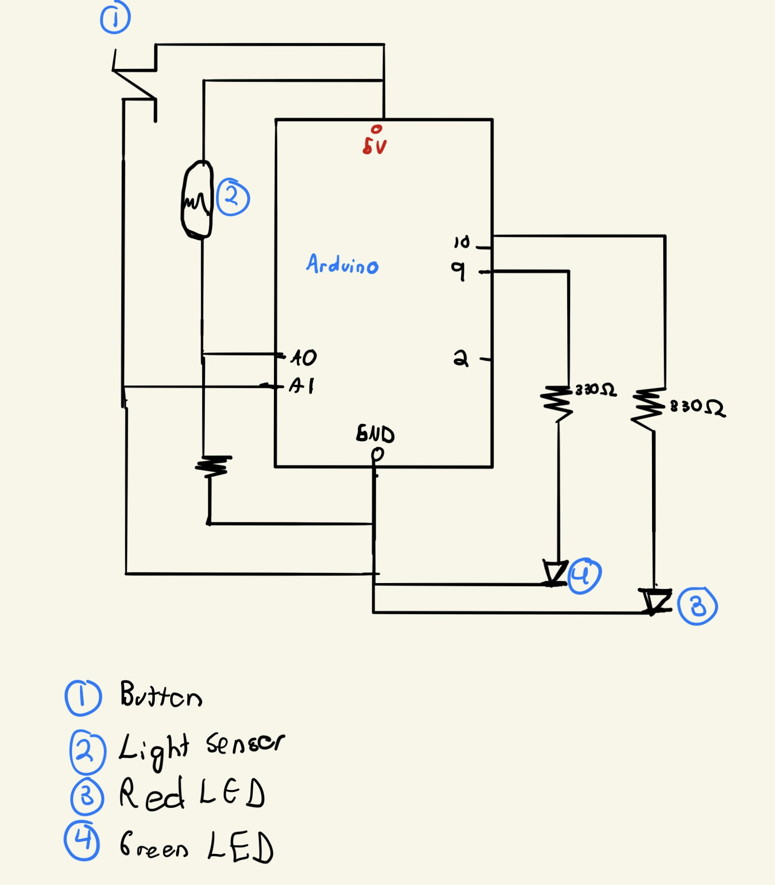

# Dancing Lights

 This program uses a light sensor and a button to explore the possibilites of I/O relationships. The user must click on the buttom to start the light sequence of the two LEDS (on and off with some delay in between) and use a flashlight to illuminate the light sensor to make the lights dance faster (decrease the delay in between the on and off of the LEDS and alternate the on and off sequence between both LEDS).

 <a href="https://youtu.be/efyjswMimUQ">Quick Demo Link</a>

# Schematics

