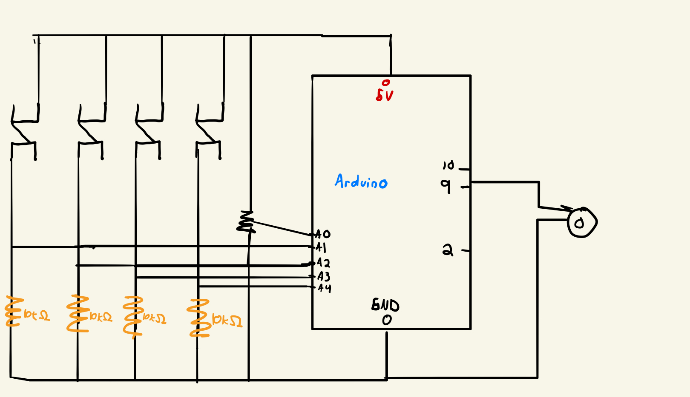

# DO-RE-MI-FA
This project is my attempt at making a small piano using arduino. As someone who doesn't know any music theory other than what I learned in my 8th grade music class, this project really forced me to think outside my comfort zone n order to make a mini piano. Also, it was a good way to practice using the tone library in processing. To play, click on a switch button to play each of the folllwing notes: 
- Blue: C4
- Red: D4
- Yellow: E4
- Green : G4
As of now, these are the only offerings my mini piano has but if I had more switch buttons then I would have probably incresed the number of notes one can play. Also, using a potentiometer, you can increase how long each tone will last. Something I did as well when I was tinkering with the electronics was to use photoresistor to increase the tone duration based on the light received. However, I diverted to a potentiometer as to me it gave my electronics a feel more similar to an actual musical instrument. 

<a hreh="https://www.youtube.com/watch?v=l3AnS9Zgzj8">Quick Demo Link</a>

# Schematics 

