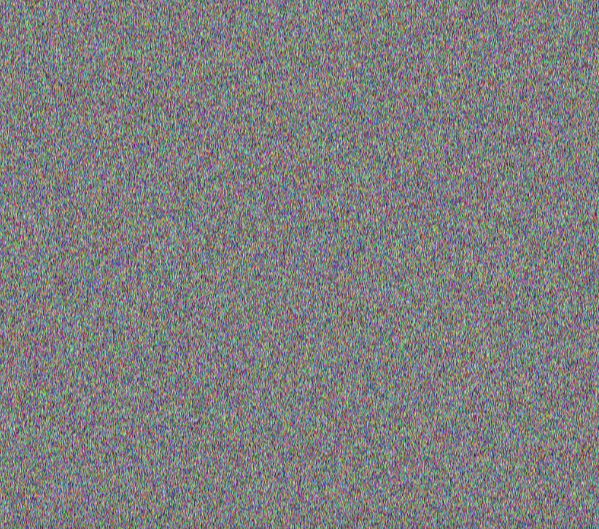
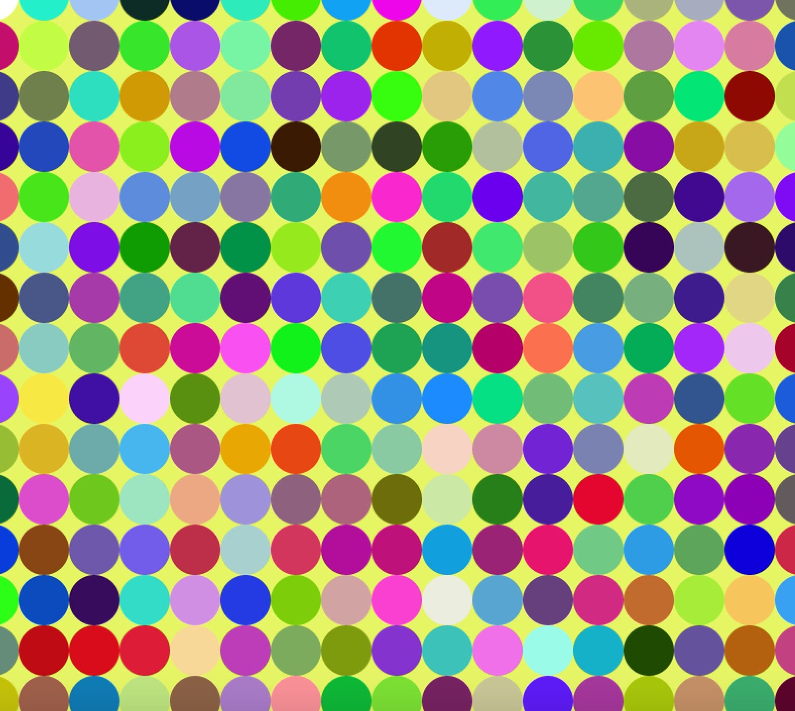

# Art with for loops and while loops

I wanted to explore the different types of art I could create using for loops and while loops. The first thing I made was something that resembles a colorful version of the static noise you see in old televisions that cannot connect to the network. 

It was made using a set of ellipses that I made along the y-axis with random fill color that I then moved along the x-axis with a variable called x-movement. The art creation process can be seen below. 

I liked how the ellipses looked like automated, art-creating agents that did the work for me as they moved from left to right along the canvas.

I kept on tinkering with the code by increasing/decreasing the steps the art-creating agents(the ellipses) took along the canvas. This tinkering resulted in some really beautiful mosaics. 

Finally, I decided to keep the mosaic's circle patterns but change the color depending on the position of the circle. This led me to recreate thee flag of my country <a href="https://en.wikipedia.org/wiki/Honduras">Honduras</a>.

