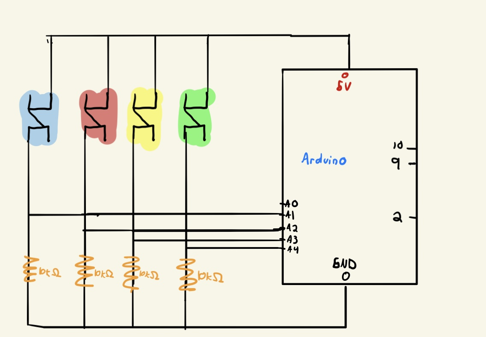

# Arduino-Processing Drawing Sketch 

## A Quick Prototype for ARt
This is a a drawing sketch where users can draw by dragging their mouse over the Processing sketch. Using the Arduino, you can change the color of your stroke by clicking one of the four colored buttons, each matching the stroke color they produce. I took a more artistic approach to this assignment as my goal for my final project is to create a collaborative, web-based drawing app using p5.js. This served as a prototype for me to gain the necessary practice I need to bring my final project idea to fruition. 

<a href="https://youtu.be/5aSBMR7tB3E">Quick Demo Link</a>

# Schematic

# Resources
- https://learn.sparkfun.com/tutorials/connecting-arduino-to-processing/all
- http://www.codasign.com/tutorials/etch-a-sketch-project/etch-a-sketch-processing-sketch/
