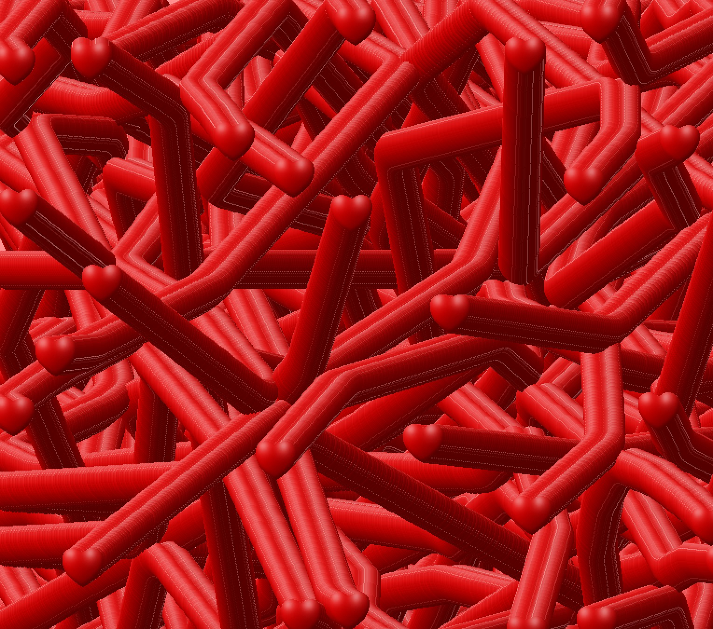

# Together we are better

 An OOP digital art piece by Junior Garcia

## Description
This digital art piece uses OOP concepts in order to create a de-stablizing system of sad faces and hearts. The canvas starts with only sad faces that become hearts after they start colliding with each other. After all faces in the canvas become hearts, the hearts start leaving a trail of hearts along their way, speaking to the exponential effect of love and care. The sad faces in the canvas  speak to the striking effect of isolation, how being alone can cause one to be sad and depressed. A feeling that can be stopped when a person seeks help from another person, a phenomena that's represented in this piece through collisions. I was inspired to create this piece as a result of being distanced from my loved ones during this pandemic. Everyone at the moment is going through a hard time, whether it is a global pandemic, standing up against injustices, or just general day to day problems. As a result, I wanted to create a piece that tells the message that human to human collaboration can create beautiful things. 
  
This is how the canvas looks like after some time.

 
## Process and Difficulties

I created a Heart class that resembles the examples  we did in class. It takes in the position and the diameter as paremeters and then the  Class methods determine the movement, collision, and display of the object. 