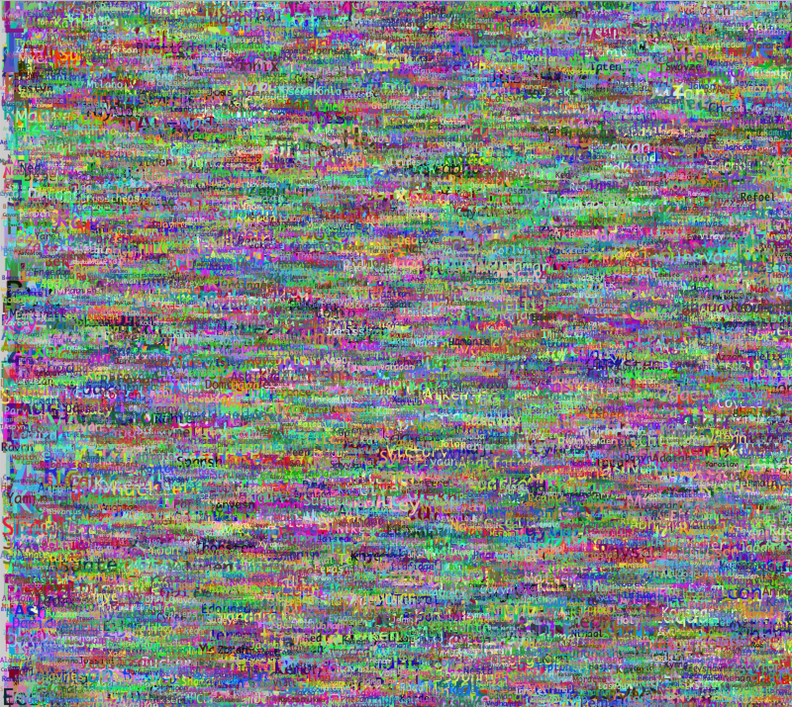
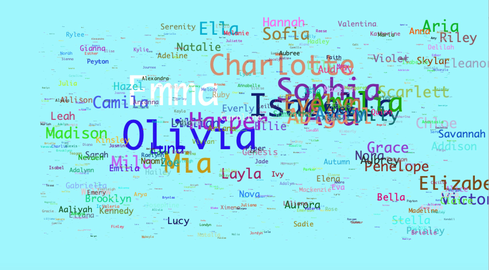
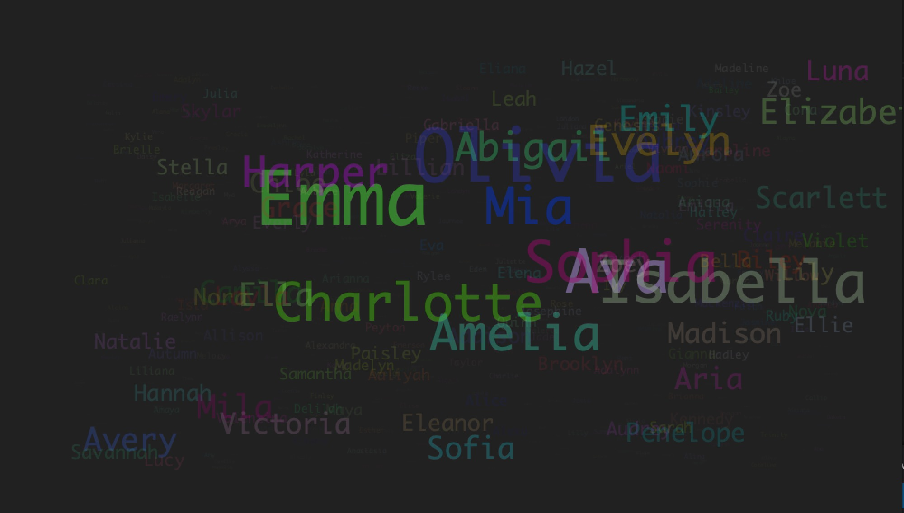

# Word Cloud Visualization of Baby Names


This project is a simple, albeit interesting visualization of baby names in the US. The original dataset includes the  most common names, ordered by most common to least common, and the count based on Social Security Records. Based on this, I decided to visualize how common these names by relating the size of the name in the canvas to the name's count value. This was my first attempt at doing so:



I realized that just using the count value as the size of the text was a very naive approach as the most common names had very big count values. As a result, I created a normalizer function that basically reduces the range of values from the original range to a smaller range determined by the size of the biggest name I want to have. 

```java
//normalizer function that returns a smaller value for the size of the text font while perserviing the difference between the original values
float normalizer(float max, float min, float value, float desired_max){
  //Normalizes between 0 and 1
  float normalized_value = (value - min)/max;
  float result = normalized_value * desired_max;
  return result;
}

```

The normalization of the range created better results. 



In addition, I decided to use the normalization function in order to also change the opacity of the name based on how common the name is. This created an even better result that was less created and best visualized how common the names are as two thing indicate so to the users: the size of the text and the opacity of thee text's color. 

