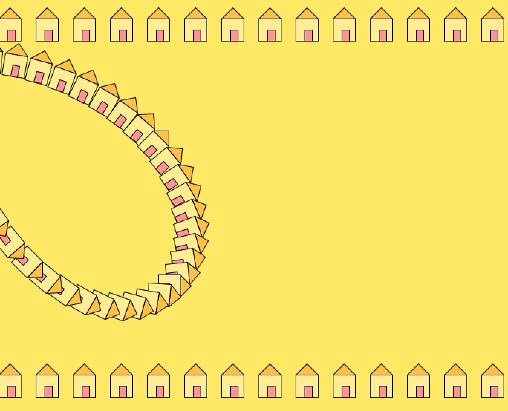

# Crazy Houses

For this project, i experimented with processing transformations to make a silly artwork. Given how the purpose of this assignment was to get practice with transformations, I allowedd myself to be silly by just tinkering around with the values of the ```rotate()``` transformations in order to yield unexpected and interesting results. This is what I came up with after tinkering with my code. 

