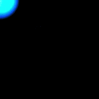

# Shy Jellyfish
By Junior Garcia



This program is based on Dan Shiffman's example of creating a flashlight effect using pixel manipulation in processing. I modified his code a bit so as to make the image size bigger and I added an additional interaction that is based on the user's mouse position. When the user's mouse hovers on top of the face of the jellyfish (which is brighter in contrast to the dark pixels thanks to Dan's code), the expression of the jellyfish becomes sad.

# Process and Implementation

One of the cool things I learned about this project was to do pixel to pixel manipulation. This required me look for the Processing info page that explans it and look for Dan Shiffman examples. I found one that does exactly what I wanted ( a flashlight effect through pixels), so I just modified the example to fit my needs. One of the changes I made to the code was to make it dynamic to an image of a defined size as the example only worked with images of size 200 * 200 pixels. This allowed me to make the canvas as big as I wanted. Then, I added my own code which changed the face of the image based on the user's mouse position. This is done like this: 

```java
  //Change the face of the jellyfish depending on the position of the mouse
  if((mouseX >= 140 && mouseX <= 210) && (mouseY>=130 && mouseY <= 200)){
    sad_smile();
    
    
  }
  else{
    
    happy_smile();
  }

```
If the mouse hovers on a defined area, the function that draws the sad smile face is called. Otherwise, the jellyfish is happy. If I had more time, I would have extended this work to include more jellyfishes and maybe create an animation that made the jellyfish run away from you as you tried to illuminate it. 
