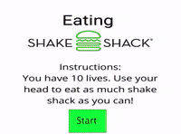

# Eating Shake Shack 


<a href="https://www.youtube.com/embed/CggBhwkwQXs"> Quick Demo Link</a>

# Description 
For my midterm project, I wanted to create something using the <a href="https://github.com/atduskgreg/opencv-processing">OpenCV Processing Library</a> after watching the assigned Daniel Shiffman tutorials on Computer Vision. I was inspired by how powerful computer vision is and I started envisioning the myriad of different applications where computer vision could be applicable. Instead of pursuing the ones that were useful and inspirational for spciety, I decided to pursue the one that merges two of my favorite things: coding and eating. <a href="https://www.shakeshack.com/">Shake Shack</a> is my favorite fast food restaurant and is the reason I workout every week. Inspired by games like Pacman and movies like Cloudy with a Chance of Meat Balls, a user needs to eats as much Shake Shack food items as he/she possibly can. Wasting Shake Shack is the worst thing you could do to me, so the user is penalized and eventually looses after letting 10 delicious Shake Shack items slip away. 

# Instructions 

- Download this folder (midterm_project). Make sure to preserve the file structure in your computer. 
- Using the Processing IDE, open the sketch and hit play. 
- Use your head to eat as much Shake Shack as you can!
- Don't you dare let any Shake Shack item slip away.


# Process and Implementation Issues
Coding out the project had its fair bits of challenges, as with any other project. On a high level, the Open CV abstracts away all of the difficult Computer Vision stuff, leaving me with the task of only coding the game conditions and rules. I made two Classes for this game, ```Food``` class and a ```Player Class```. Both describe how the different elements in the game will be drawn in the screen. The Player Class is in charge of determining the collision between itself and any Food object using the ```dist()``` function in Processing. The Food Class is in charge of removing the player's lives whenever its eaten condition has been set to true (done by the player as described above) and its left the canvas. I also implemented state variables to display instructions and a loosing screen and increasing game difficulty based on time. Belowe are some of the changes encountered as I made the game:

- Dealing with calculations applied before and after scaling: 
The Open CV beginner example which acted as the boilerplate for this project required me to scale the video feed. This brought me back to my Computer Graphics class of dealing with matrix transformation and a change of coordinate system. In order to counter act this transformations, I "scaled down" so to speak every Food object by  passing in the scale factor in the constructor and dividing all of its propoerties (x,y,width,etc.) by the scale factor. This alos prevented from doing complicated matrix algebra every single framee of the draw loop. 
    
- Using the millis library to create new food items based on time. 
I decided to use frame count instead as the millis library was less accurate.     
   
- Separating the y space between the different food items appearing. 
  
This is still an issue I have, especially in the medium and hard levels where I want more items to appear consecutively to the user. I somehow masked this issue by increasing the velocity as well so as to create the illusion that they are separated. 

- Making the  player loose after 3 food items_ go out of range.

```java
  boolean check_if_loose(Food received_food){
      if (received_food.food_y>height && received_food.eaten == false){
        return true;  
      }
      else{
        return false;
      }
  
  }
```
The problem with this loose condition is that it was reducing a live every single frame. What I did to solve this was to implement this function on the Food Class itself and make sure that a food item can only reduce one of the user's lives. Maybe this issue could be solved altogether if I can just delete the instance of a class, but Im unaware if this can be done in Java. 

- Restarting the game. I think a lot of memory is being wasted.
As stated before, I am instatiating a lot of objects and I am not doing any clean up. one of the improvements I could to do is to understand how Java works on a lower-level so as to free up unused memory that comes from completely deleteing the eaten food object instances. This will make my game more memory efficient and will make my computer less hot after playing this game for 5 minutes. 

# References 
This projects is merely an extension of some very useful tutorials and explanations online. Thanks to:
- The Processing Reference Page and the Processing Forum
- <a href="https://www.youtube.com/playlist?list=PLRqwX-V7Uu6aG2RJHErXKSWFDXU4qo_ro">Dan Shiffman's Computer Vision Tutorial</a>
- <a href="https://github.com/atduskgreg/opencv-processing">OpenCV Processing Library</a>
- <a href="https://www.shakeshack.com/">Shake Shack</a>, for being delicious and awesome.